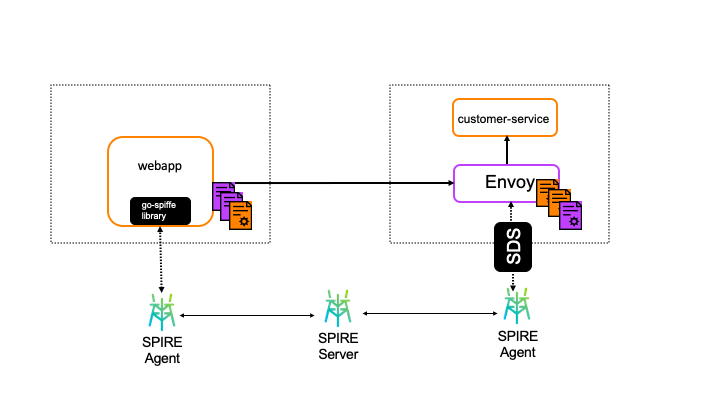

# Provisioning dynamic service identities for Envoy 

Envoy is a popular open-source service proxy that, among other things, is widely used to provide abstracted, secure, authenticated and encrypted communication between services. Envoy enjoys a rich configuration system that allows for flexible third-party interaction.
One component of this configuration system is the Secret Discovery Service protocol or SDS. Envoy uses SDS to retrieve and maintain updated “secrets” from SDS providers. In the context of authentication, these secrets are the TLS certificates, private keys, and trusted CA certificates Envoy uses to provide secure TLS communication between services.

When Envoy connects to the SDS server the SPIRE Agent attests Envoy and determines which service identities and CA certificates it should make available to Envoy over SDS.

In this scenario we have two entities between which we establish a mTLS(mutual TLS) connection:
 1. `customer service` backend serving static content using NGINX, simulating a JSON API. 
 2. `webapp` frontend, configured to fetch data from the JSON API exposed by the `customer service`.
 
Envoy is deployed as a sidecar proxy along side the `customer service` and abstracts securing the connection on behalf of the `customer service`. 
This scenario guides you through the steps to configure and deploy envoy to use SPIRE as a SDS server. During the exercise you will: 
1. Register `customer service` and `webapp` workloads with SPIRE
2. Deploy `customer service` and `webapp` workloads
3. Deploy and configure Envoy to use SPIRE SDS server
4. Establish secure mTLS connectivity between `customer service` and `webapp` workloads
   
Note that the `webapp` frontend is written in `go` and uses the native `go-spiffe` library to obtain its [x509 SVID](https://github.com/spiffe/spiffe/blob/master/standards/X509-SVID.md) and establish mutually authenticated TLS (mTLS) with the `customer service` backend. 
The usage of `go-spiffe` library is out of scope in this scenario, the detailed documentation of using go-spiffe library is here: [go-spiffe v2 documentation and examples](https://pkg.go.dev/github.com/spiffe/go-spiffe/v2?tab=overview)

