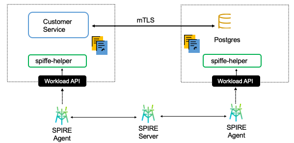

# Authenticating to Postgres Database with X.509-SVID
The scenario showcases how we can use SPIRE-issued identities (specialized X.509 certificates) to directly authenticate to databases using their standard, built-in PKI authentication.
This approach does not rely on a secret store. Instead, short-lived asymmetric keys encrypt all traffic to the database so it's secure even if your network is compromised. 

In this Kubernetes-based scenario, an application authenticates to Postgres using its SPIFFE ID and makes changes in the Postgres database. The nodes in the Kubernetes cluster use SAT (Service Account Token) node attestation to register the identity of the cluster to the SPIRE Server.
The SPIRE Server is deployed as a stateful set and SPIRE Agents are deployed as a daemonset. 

Constrained by the Katacoda demo environment, both the Postgres database and sample customer application are deployed on Kubernetes, but SPIFFE authentication works across cloud-to-cloud, cloud-to-bare-metal, and Kubernetes-to-Linux deployment scenarios.

The deployment and configuration details of running SPIRE on Kubernetes is beyond the scope of this demo aside from performing the
necessary steps to deploy SPIRE into the cluster and to create the node and workload attestation entries.

During the exercise you will: 
1. Deploy SPIRE on Kubernetes
2. Register `postgres database` and `customer service` workloads with SPIRE
3. Deploy `postgres database` and `customer service` workloads on Kubernetes
4. Examine the `postgres database` configuration that restrict SSL only connections
5. Examine the `spiffe-helper` configuration that manage the Posgres SSL certificates
6. Examine the `customer service` and corresponding `spiffe-helper` configuration
7. Verify mTLS connectivity between `customer service` and `postgres database` by disabling and re-enabling the database client user.

